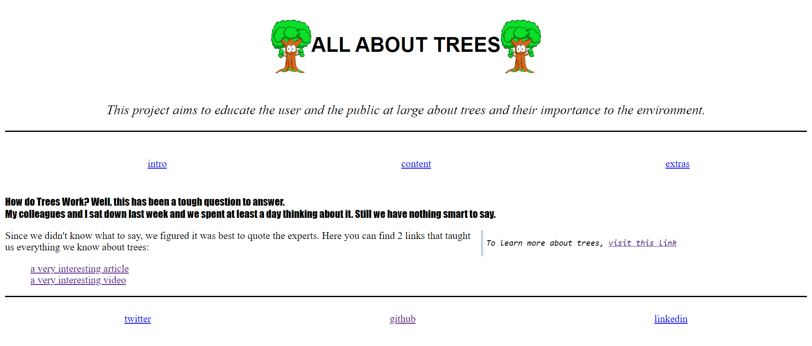

# All about trees

> This project is about trees and the importance of trees.

## Table of contents

- [All about trees](#all-about-trees)
  - [Table of contents](#table-of-contents)
  - [General info](#general-info)
  - [Screenshots](#screenshots)
  - [Technologies](#technologies)
  - [Setup](#setup)
  - [Code Examples](#code-examples)
  - [Features](#features)
  - [Status](#status)
  - [Inspiration](#inspiration)
  - [Contact](#contact)
  - [Instructions for use](#instructions-for-use)
  - [Code Quality Checks](#code-quality-checks)
  - [Continuous Integration (CI)](#continuous-integration-ci)
  - [Repo Setup](#repo-setup)

## General info

> Trees, the majestic giants of the plant kingdom, stand as silent sentinels of
> nature's grace. With their sturdy trunks and verdant canopies, they offer
> shelter to countless creatures and contribute to the oxygen we breathe. From
> the delicate blossoms of cherry trees to the towering strength of oak, each
> species brings a unique charm to the landscape. Trees play a vital role in
> maintaining ecological balance, preventing soil erosion, and providing shade
> in the heat of summer. Their leaves whisper in the breeze, telling stories of
> seasons gone by. In every forest, trees form a resilient community, showcasing
> the beauty of life rooted firmly in the earth.

## Screenshots



## Technologies

- VSC code
- HTML
- CSS
- ...

## Setup

- `clone the repo`
- `open index.html with live server`

## Code Examples

```HTML
  <header class="centered-items">
    <!-- Logo  -->
    
    <!-- Title  -->
    <h1>All About Trees</h1>
    <!-- Logo  -->
    
  </header>
```

## Features

List of features ready and Todos for future development

-
-
-

To-do list:

-
-

## Status

Project is: _in progress_

## Inspiration

Project by freeCodeCamp.org

## Contact

By [Name]
