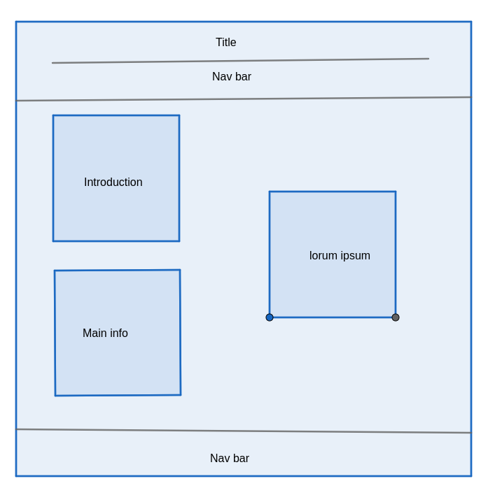

# Design

## Project's design overview

Our project focuses on trees and their importance, aiming to create awareness,
promote conservation efforts, and engage the community in tree-related
activities.

### Project Objective and Scope:

We aim to enhance the local environment by increasing tree cover, improving
biodiversity, and fostering a sense of stewardship among residents. Our project
will primarily target urban areas where tree cover is limited and environmental
awareness is needed.

### Research and Data Collection:

We've conducted thorough research on the types of trees suitable for our region,
their ecological benefits, and the current state of tree cover. Additionally,
we've gathered data on local biodiversity and existing conservation initiatives.

### Stakeholder Analysis:

Key stakeholders include local government agencies, environmental organizations,
schools, businesses, and community groups. Understanding their interests and
contributions will be crucial for the success of our project.

### Project Planning:

Our project plan includes detailed goals, activities, timelines, and resource
allocations. We've considered factors such as budget, manpower, permits, and
logistical requirements to ensure effective implementation.

### Community Engagement:

We'll engage the community through educational programs, workshops, and outreach
events to raise awareness about the importance of trees. Community involvement
in tree planting and maintenance activities will be encouraged to foster a sense
of ownership.

### Tree Planting and Conservation:

We'll organize tree planting events in collaboration with local partners and
implement measures for tree care, including watering, mulching, and pruning.
Additionally, we'll establish conservation areas to protect existing trees.

### Monitoring and Evaluation:

A robust monitoring and evaluation system will track the progress of our
project, including tree growth, survival rates, and changes in biodiversity.
We'll regularly assess the impact of our interventions on the local environment
and community.

### Partnerships and Collaboration:

We'll seek partnerships with local businesses, schools, and organizations to
enhance the effectiveness and sustainability of our project. Additionally, we'll
explore funding opportunities and grants to support our initiatives.

### Documentation and Reporting:

Detailed records of project activities, expenses, and outcomes will be
maintained. Project updates and success stories will be shared through various
channels to keep stakeholders informed.

### Continuous Improvement:

Feedback from stakeholders and participants will be solicited to identify areas
for improvement. We'll adapt and refine our strategies based on lessons learned
and changing circumstances to ensure long-term success.

---

## Wireframes

